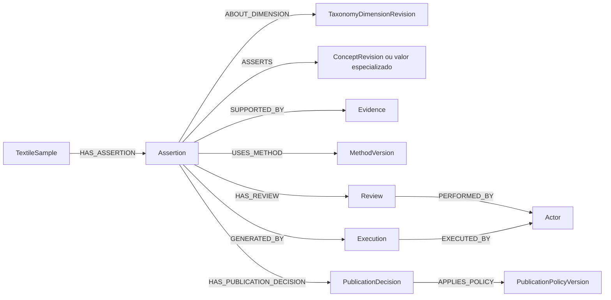

# Modelagem em grafo v0.4

**Base:** taxonomia têxtil PHYLLOS v0.3

**Status:** candidata de implementação

**Substitui:** proposta de modelagem v0.3, sem alterar a taxonomia v0.3 nem o benchmark 1

## 1. Decisão arquitetural

Usar property graph com `Assertion` como unidade atômica de afirmação. Nenhum valor de medição, composição, função declarada ou nome comercial ganha status público sem atravessar uma asserção e uma decisão de publicação versionada.



## 2. Separação obrigatória em `Assertion`

```yaml
id: assertion:TX-001:familia:001
assertion_kind: observed | measured | inferred | declared | derived
evidence_status: absent | declared | calculated | documented | verified
confidence_level: high | medium | low | indeterminate
confidence_is_calibrated: false
calibration_version: null
capture_quality: adequate | limited | insufficient | not_applicable
review_state: unreviewed | accepted | corrected | disputed | rejected
status: active | superseded | rejected | under_review
asserted_at: datetime
```

Invariantes:

- `inferred` nunca eleva `evidence_status`;
- `verified` exige evidência aceita, método aplicável e revisão humana;
- probabilidade numérica exige `calibration_version`;
- confiança não determina publicação;
- correção gera nova asserção ligada por `SUPERSEDES`.

## 3. Publicação como decisão, não propriedade livre

Remover `publicable_from_inference` de `TaxonomyDimension`. Remover `publicability` editável diretamente de `Assertion`.

```yaml
PublicationDecision:
  id: publication-decision:001
  outcome: publish | publish_with_status | withhold | request_more_evidence
  reason_codes: []
  decided_at: datetime

PublicationPolicyVersion:
  id: phyllos-evidence-publication-policy:v1
  version: 1.0.0
  effective_from: date
  immutable_hash: sha256
```

Fluxo:

```text
Assertion
→ HAS_PUBLICATION_DECISION
→ PublicationDecision
→ APPLIES_POLICY
→ PublicationPolicyVersion
```

Regras mínimas:

- composição inferida: `withhold`;
- função declarada sem fonte ou método: `withhold`;
- captura insuficiente: `request_more_evidence`;
- nome comercial de alta ambiguidade: `request_more_evidence`;
- campo obrigatório ausente: preservar ausência no manifesto público conforme política, nunca inventar valor.

## 4. Taxonomia imutável e versionada

Separar identidade estável de revisão:

```text
TaxonomyConcept
→ HAS_REVISION
→ TaxonomyConceptRevision
→ PART_OF_VERSION
→ TaxonomyVersion
```

O mesmo se aplica a módulos e dimensões.

```yaml
TaxonomyConcept:
  id: concept:estrutura.tecido_plano

TaxonomyConceptRevision:
  id: concept-revision:estrutura.tecido_plano:v0.3
  code: tecido_plano
  label_pt: Tecido plano
  status: active
```

Regras:

- revisões publicadas são imutáveis;
- versão nova cria novos nós de revisão;
- IDs de revisão nunca são reutilizados;
- asserções apontam para a revisão que estava vigente no momento da classificação;
- reclassificação posterior cria nova asserção, sem alterar a histórica.

## 5. Valores especializados também passam por `Assertion`

### Medição

```text
Assertion ──ASSERTS_MEASUREMENT──> Measurement
Measurement ──MEASURES──> MeasurementType
Measurement ──USES_UNIT──> Unit
Measurement ──USES_METHOD──> MethodVersion
Measurement ──MEASURED_ON──> TextileSample
```

### Composição

```text
Assertion ──ASSERTS_COMPOSITION_COMPONENT──> CompositionComponent
CompositionComponent ──USES_FIBER──> FiberConceptRevision
Assertion ──SUPPORTED_BY──> Evidence
```

Percentual, origem, conteúdo reciclado, certificação e rastreabilidade são asserções independentes quando possuírem fontes ou estados diferentes.

### Acabamento e função

```text
Assertion ──ASSERTS_FINISH_APPLICATION──> FinishApplication
FinishApplication ──USES_PROCESS──> FinishProcessRevision

Assertion ──ASSERTS_DECLARED_FUNCTION──> DeclaredFunctionRevision
Assertion ──SUPPORTED_BY──> Evidence
Assertion ──USES_METHOD──> MethodVersion
```

Processo nunca propaga automaticamente função.

### Nome comercial

```text
Assertion ──ASSERTS_COMMERCIAL_NAME──> CommercialNameRevision
CommercialNameRevision ──HAS_AMBIGUITY_LEVEL──> AmbiguityLevel
```

Compatibilidade com estrutura ou fibra é uma relação de conhecimento, não uma classificação automática da amostra.

## 6. Evidência e integridade

```yaml
Evidence:
  id: evidence:IMG-001
  evidence_type: image | document | supplier_declaration | lab_report | certificate | physical_observation
  artifact_uri: string | null
  artifact_hash: sha256 | null
  artifact_integrity: verified | invalid | unknown
  source_authenticity: verified | unverified | unknown
  evidentiary_relevance: sufficient | limited | insufficient | unknown
  issued_at: datetime | null
  issuer_actor_id: string | null
```

`artifact_integrity = verified` significa apenas que o arquivo confere com seu hash. Não confirma o conteúdo nem o valor da asserção.

Inferência visual não é um subtipo de evidência. Ela é produzida por uma `Execution` que consumiu imagens:

```text
Execution ──CONSUMED──> Evidence
Execution ──PRODUCED──> Assertion
Execution ──USES_MODEL──> ModelVersion
Execution ──USES_PROMPT──> PromptVersion
Execution ──USES_CALIBRATION──> CalibrationVersion
```

## 7. Revisão e atores

```yaml
Actor:
  id: string
  actor_type: human | model | system | organization

Review:
  id: string
  outcome: accepted | corrected | disputed | rejected
  notes: string | null
  reviewed_at: datetime
```

```text
Assertion ──HAS_REVIEW──> Review
Review ──PERFORMED_BY──> Actor
Review ──APPLIES_POLICY──> ReviewPolicyVersion
```

## 8. Conflitos e substituição

Conflito é reificado para registrar escopo e resolução:

```text
Assertion ──PARTICIPATES_IN──> AssertionConflict
AssertionConflict ──RESOLVED_BY──> Review
```

```yaml
AssertionConflict:
  id: string
  conflict_type: contradictory_value | source_disagreement | method_disagreement | temporal_change
  status: open | resolved | accepted_coexistence
```

`SUPERSEDES` representa evolução temporal; não deve ser usado como sinônimo de conflito.

## 9. Benchmark como capacidade versionada

```text
BenchmarkVersion ──INCLUDES_DIMENSION──> TaxonomyDimensionRevision
BenchmarkVersion ──ALLOWS_CONCEPT──> TaxonomyConceptRevision
BenchmarkVersion ──ALLOWS_DECISION──> DecisionType
ModelVersion ──EVALUATED_ON──> BenchmarkRun
BenchmarkRun ──USES_BENCHMARK──> BenchmarkVersion
```

Conceitos fora do benchmark continuam na ontologia, com automação bloqueada pela política de capacidade.

## 10. Regras de escrita

Neo4j não será a única camada de validação. A escrita deve seguir:

1. validar o comando contra JSON Schema;
2. aplicar invariantes e política no serviço;
3. gravar asserção, evidência, revisão e decisão em uma transação;
4. executar consultas de auditoria como defesa adicional;
5. bloquear publicação quando a auditoria encontrar violação crítica.

## 11. Constraints mínimas

```cypher
CREATE CONSTRAINT assertion_id IF NOT EXISTS
FOR (n:Assertion) REQUIRE n.id IS UNIQUE;

CREATE CONSTRAINT evidence_id IF NOT EXISTS
FOR (n:Evidence) REQUIRE n.id IS UNIQUE;

CREATE CONSTRAINT taxonomy_concept_revision_id IF NOT EXISTS
FOR (n:TaxonomyConceptRevision) REQUIRE n.id IS UNIQUE;

CREATE CONSTRAINT taxonomy_dimension_revision_id IF NOT EXISTS
FOR (n:TaxonomyDimensionRevision) REQUIRE n.id IS UNIQUE;

CREATE CONSTRAINT publication_decision_id IF NOT EXISTS
FOR (n:PublicationDecision) REQUIRE n.id IS UNIQUE;

CREATE CONSTRAINT publication_policy_version_id IF NOT EXISTS
FOR (n:PublicationPolicyVersion) REQUIRE n.id IS UNIQUE;

CREATE CONSTRAINT review_id IF NOT EXISTS
FOR (n:Review) REQUIRE n.id IS UNIQUE;

CREATE CONSTRAINT execution_id IF NOT EXISTS
FOR (n:Execution) REQUIRE n.id IS UNIQUE;
```

## 12. Gate para protótipo

A modelagem pode avançar ao protótipo quando:

- fixtures válidas são aceitas;
- fixtures inválidas são rejeitadas pelo motivo esperado;
- nenhuma composição inferida recebe decisão de publicação;
- nenhuma função sem fonte e método é publicada;
- uma revisão da v0.4 não altera nós da v0.3;
- toda inferência aponta para execução, modelo, prompt e evidências consumidas;
- toda decisão pública aponta para política versionada;
- correções preservam o histórico.


---

## Errata de implementação 0.4.1

Para alinhar o contrato aprovado:

- `assertion_kind=inferred` exige `evidence_status=absent`;
- `evidence_status=calculated` é reservado a `assertion_kind=derived`;
- derivação calculada exige método ou fórmula versionada e `derived_from_assertion_ids` não vazio;
- `documented` indica preservação do artefato que sustenta uma observação ou declaração, não verificação da propriedade têxtil.
